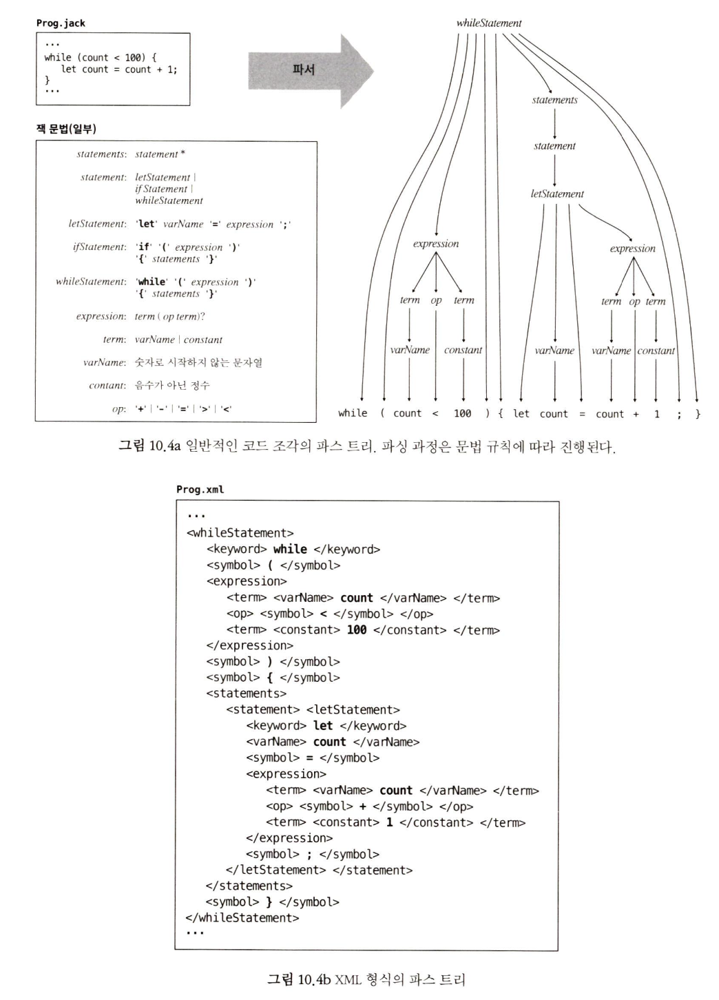

## 컴파일 
- 컴파일러는 원본 언어에서 대상 언어로 프로그램을 번역하는 프로그램이다. 

### 번역 과정 
- 1) 구문 분석 (이번 장에서 내용)
- 2) 코드 생성 (11장에서 다룰 예정)

### 컴파일러가 프로그램을 이해한다의 의미
- 1) 생성한 코드가 의도대로 동작한다면 이해한다고 말할 수 있음 
- 2) 이번장에서는 구문 분석기 모듈만 만들거니까, XML 출력해보기 

### 컴파일러를 만들어 보는 이유 ? 
- 1) 컴파일러 내부 원리를 이해하면 더 수준 높은 프로그래머가 될 수 있다. 
- 2) 자연어 처리 (인공지능 응용프로그램의 기반 기술)분야에서도 텍스트 분석 + 의미 합성하는 일을 한다. 
- 3) 대부분의 프로그래머들이 복잡하고 다양한 구조의 텍스트나 데이터를 분석하고 처리하는 일을 하게 될 가능성이 크다.

=> 이런 작업들은 이 장에서 설명하는 알고리즘과 기법들을 활용하면 효율적이고 우아하게 처리할 수 있다. 

### 이번 장 순서 
- 1) 배경 절 : 구문 분석기를 만드는데 필요한 최소한의 개념 소개 
    - lexical analysis (어휘 분석)
    - context-free grammar (문맥 자유 문법)
    - parse tree (파스 트리)
    - recursive descent parsing algorithm (재귀 하향 파싱 알고리즘)
- 2) 명세 절 : 잭 언어 문법과 잭 분석기가 생성하는 출력 정의 
- 3) 구현 절 : 잭 분석기의 API와 함께 잭 분석기를 구성하기 위한 소프트웨어 아키텍처를 소개 

## 배경
- 구문 분석 단계는 대개 두 세부 단계로 더 나뉘어진다. (컴파일은 구문 분석, 코드 생성 두 단계로 구성) 
    - tokenizing : 언어의 기본 요소(token)들로 분류 
    - parsing : 토큰들을 의미가 있고 구조화된 명령문들로 분석 
- 토큰화 및 파싱 작업은 대상 언어와는 완전히 독립적이다. 
- 구문 분석기가 프로그램을 분석한 구조를 XML 파일 형식으로 출력 하도록 할 것 

### XML 출력기 : 장점
- 1) XML 파일로 출력하면 구문 분석기가 소스 프로그램을 제대로 분석했는지 쉽게 확인할 수 있다. 
- 2) XML 파일을 명시적으로 출력하도록 하면 나중에 구문 분석기를 컴파일러로 만들기 용이해진다. 

### 구문 분석의 개념 : 사람과 컴파일러의 차이 
- 사람은 소스 코드를 읽으면 프로그램의 구조를 파악할 수 있다. 
    - 언어의 문법을 마음속으로 이해하기 때문에 가능한 일이다. 

- 이 문법적 통찰력 덕분에,
    - 클래스와 메서드가 어디서 시작하고 끝나는지, 
    - 무엇이 선언문이고, 명령문이고, 표현식인지, 
    - 그리고 그것들이 어떻게 구성되었는지 등을 인지할 수 있다. 

- 사람은 이런 중첩된(nested) 언어 구조를 인식하기 위해, 이 구조들을 언어의 문법이 허용하는 텍스트 패턴들에 단계적으로 연결해 나간다. 

- 구문 분석기도 마찬가지로 문법 (프로그래밍 언어 구문을 정의하는 규칙들)에 따라 구조를 쌓아 올리는 방식으로 구현할 수 있다. 

- 주어진 프로그램을 이해(parsing) 한다는 것은 프로그램의 텍스트와 문법 규칙 사이에 정확한 대응 관계를 결정한다는 뜻이 된다. 

=> 그러려면 프로그램의 텍스트를 토큰들로 구성된 리스트로 재구성해야 한다. 

### 토큰화 (어휘 분석)
- 프로그래밍 언어 명세에는 토큰(또는 단어)유형이 명시된다.
- 잭 언어에서는 다섯 가지 유형이 있다. 
    - 키워드 (class, while)
    - 기호 (+, -)
    - 상수 (17,314)
    - 문자열 상수 ("FAQ", "Frequently Asked Questions")
    - 식별자 (변수, 클래스, 서브루틴의 이름을 뜻하는 텍스트 레이블 -> ?)

    => 이런 유형으로 정의되는 토큰들을 모아서 언어의 어휘(lexicon)라 부른다. 
    
- 가장 단순한 형태의 컴퓨터 프로그램은 텍스트 파일에 저장된 문자열이다. 
- 구문 분석의 첫 단계는 공백이나 주석은 무시하고, 문자들을 언어 어휘로써 정의된 토큰들로 분류하는 것이다. (어휘 분석, 스캐닝 또는 토큰화로 불림) 
- 일단 프로그램이 토큰화되면, 문자가 아닌 토큰들이 기본 단위가 된다. 따라서 컴파일러의 주요 입력도 일련의 토큰들이 된다. 
- 토큰화는 간단하면서도 중요한 작업이다. 어휘가 정해졌을 때, 주어전 문자 스트림을 토큰 스트림으로 바꾸는 프로그램을 장성하는 것은 어렵지 않다. 
- 이 기능은 구문 분석기를 개발하기 위한 첫 번째 디딤돌이다. 

## 파서 

