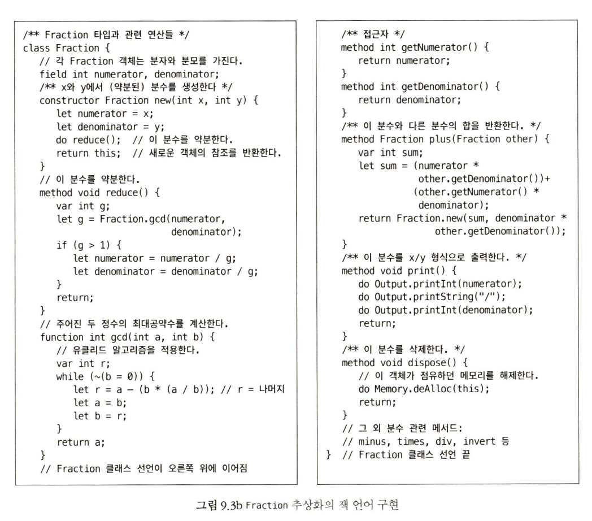

### 9장의 목표

- 잭 컴파일러를 만들어 보기 전 JACK 언어에 익숙해지는게 목표

### JACK 언어 개요

- 잭은 '객체 기반' 언어. 객체와 클래스는 지원하지만 상속은 지원하지 않는다.
  - C (절차 지향) 와 C++(객체 지향) 사이 어딘가에 있음
- do, let, return, 연산자 우선순위를 두지 않는 이유 : 컴파일러를 최대한 단순하게 개발 할 수 있게 하기 위해 

### 예제 코드

### JACK 명세

- OS는 8개의 클래스로 구성 : Math, String, Array, Output, Screen, Keyboard, Memory, sys

- subroutine

  1. function : 전역 호출 가능
  2. method : 특정 객체에 종속된 함수
  3. constructor : 객체 생성 및 this 초기화

- 변수

  1. static : 클래스의 모든 서브루틴들이 공유한다 (java의 private static 변수와 같음)
  2. field : 인스턴스 레벨에서 독립적 (java의 멤버 변수와 같음)
  3. var : 지역 변수 - 서브루틴이 실행할 때 생성. 반환되면 소멸
  4. 매개 변수 : 서브루틴 인자

- 변수 초기화

  1. static : 프로그래머가 초기화
  2. field : 생성자가 초기화
  3. var : 프로그래머가 초기화
  4. 매개변수 : 전달된 인수 값으로 초기화

- 명령문

  1. let : 할당 연산
  2. do : 함수, 메서드 호출할 때 사용
  3. return : void에서도 꼭 사용해야함

  - if, while,

- 객체 생성과 삭제

  - 생성자 이름은 무엇이든 써도 되지만 규칙에 따라 하나는 이름을 new로 한다.

    - ex) let c = Circle.new(x,y,50)

  - 가비지 컬렉션이 없으므로, OS 함수인 Memory.deAlloc(object) 함수 호출해서 메모리 할당 해제
    - dispose()메서드 캡슐화 하는게 좋다.

- 연산자 우선순위
    - 괄호 안 표현식 우선 평가를 제외하고 연산자 우선순위를 정의하지 않는다. 
        - 2+(3*4) = 14
        - 2+3*4 = 20
    - 독자가 원한다면 연산자 우선순위를 언어 명세에 추가한 버전의 컴파일러를 만들어도 된다.   