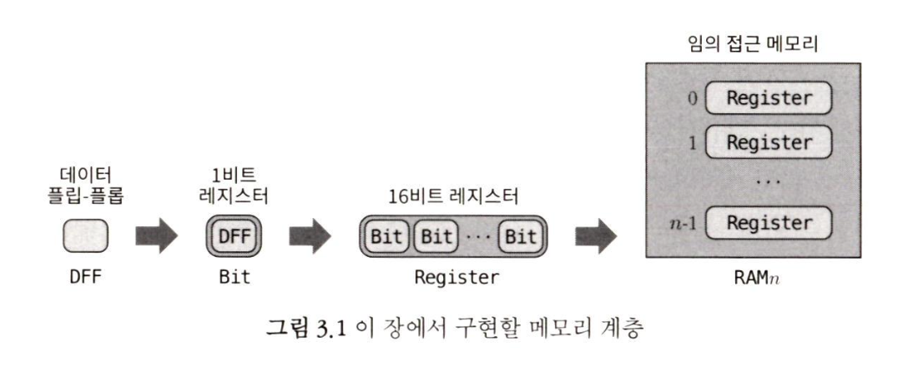
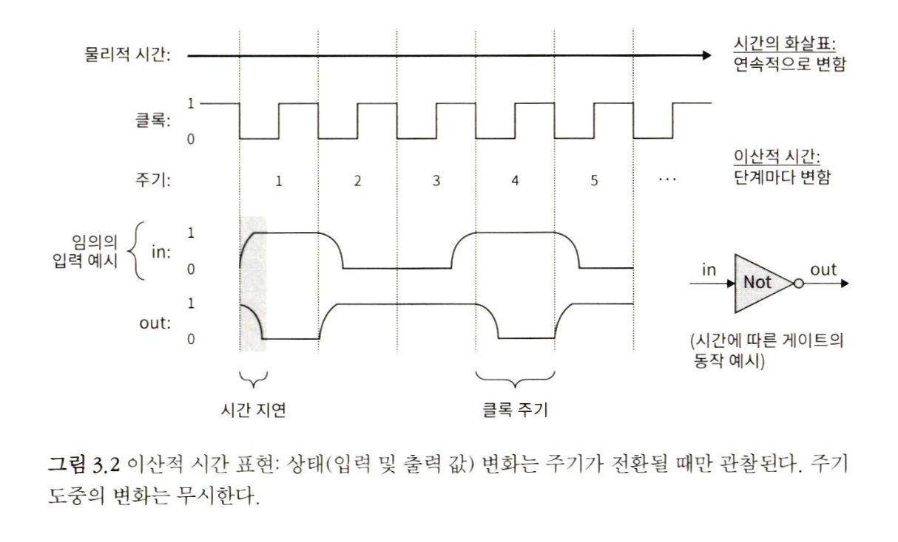
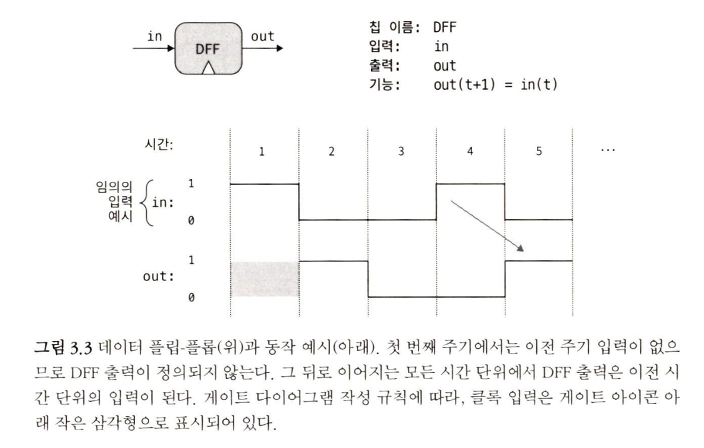
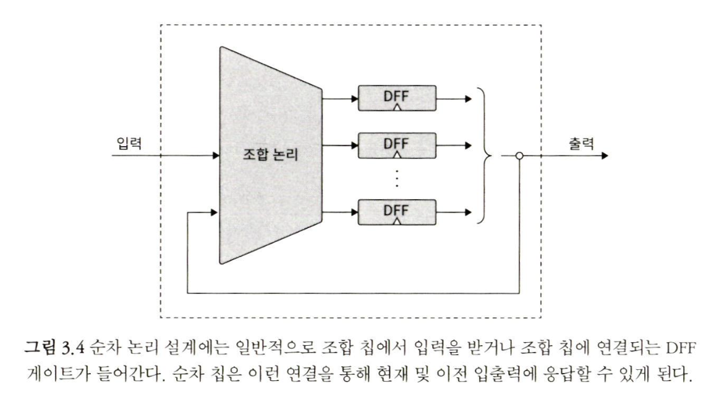

## 3장 메모리

시간의 진행은 틱 tick 과 톡 tock 이라는 2진 신호를 연속적으로 생성하는 클록 clock 을 이용해 모델링할 수 있다. 틱의 시작과 다음 톡의 종료 사이의 시간을 주기 cycle 라 하는데, 이 주기는 컴퓨터의 모든 메모리 칩의 작동을 조정하는 역할을 한다.

논리 게이트를 이용해서 일정 시간 동안 값을 저장하는 방법, 즉 x 같은 변수가 값을 '기록' 하도록 설정하고, 다른 값을 설정할 때까지 그 값을 유지하게 하는 방법을 배울 차례다

`메모리 칩`

### 3.1 메모리 장치

우리는 클록과 함께, 0 과 1 의 두 안정 상태를 왔다 갔다 flip and flop 할 수 있
는 시간의존적 논리 게이트를 도입해서 이 문제를 해결하고자 한다. 이 게이트는 데이터 플립- 플롭 data flip-flop, DDF 이라 불리며, 모든 메모리 장치를 만드는 데 기본 구성 블록이 된다.

DFF는 눈에 띄는 역할을 하는 장치들과 달리 조용히 제 역할을 하는 저수준 부품이다.

DFF는 메모리 계층의 기초 역할

### 3.2 순차 논리

2가지 이유의 지연 원리

- 입력 신호는 다른 칩의 출력에서 이동해 온 것이며, 이동에는 시간이 걸린다. -> 입출력의 시간 지연
- 계산을 수행하는데 시간이 걸린다. -> 계산 수행의 시간 지연

> [!NOTE]
> 시간은 잘 다뤄야할 문제이다.

컴퓨터 과학자의 시선에서 시간은 연속적인게 아닌 주기라는 고정된 길이의 간격으로 쪼개서 볼 수 있다.

주기는 더 이상 쪼개지지 않고 가장 기본적인 단위이며, 주기가 전환될 때만 실제로 변화가 일어나며, 주기 도중에는 변화가 정지된다.

이산적인 시간 개념의 주요한 두가지 특징

1. 이산적 시간 개념을 통해, 통신이나 계산 중에 발생하는 시간 지연과 관련된 무작위성을 줄일 수 있따는 것이다.
2. 시스템 전체에서 여러 칩들의 연산을 동기화하는 데 그 개념을 활용할 수 있다.

주기 길이는 시스템 내 모든 칩에서 발생하는 최대 시간 지연보다는 살짝 더 길게 잡아야 한다.

- 결과를 관찰해야하기 때문에.

### 3.2.2 플립 플롭

Nand to Tetris에서는 입출력이 1비트 데이터로 된 DFF (data flip-flop)라는 게이트를 사용한다.

DFF는 데이터 입력과 클록 입력을 종합해서 out(t)=in(t-1) 이라는 시간에 따른 간단한 동작을 구현한다.

DFF는 Nand 게이트와 마찬가지로 하드웨어 계층에서 가장 기초가 된다.

### 3.2.3 조합 및 순차 논리

주기 변화에 따라 값의 결과가 반영되고, 주기 변화 중에는 결과가 존재하지 않는다.

따라서 피드백 루프의 결과가 현재 주기 t가 아닌 t-1의 결과 값이기 때문에 오류에 휩싸이지 않는다.

