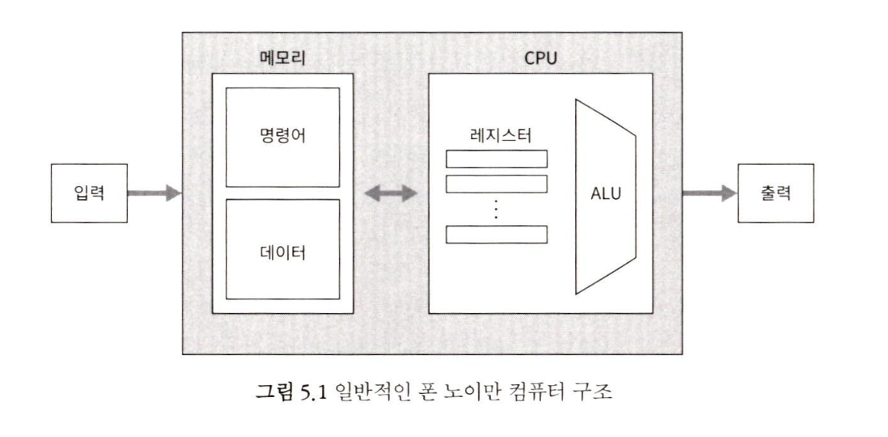

# 5장 컴퓨터 아키텍처

> [!WARNING]
> 이 장은 하드웨어 부분의 정점이다.

폰 노이만 구조의 한 예로 `핵 플랫폼`을 만들 예정

최적화의 중요성을 배울 수 있다.

## 5.1 컴퓨터 아키텍처 기초

### 5.1.1 내장식 프로그램 개념

`내장식 프로그램 Stored Program`

본래의 컴퓨터는 단순한 명령의 집합을 고정된 하드웨어 플랫폼에 바탕을 두고 있었다.

1930년대 이전의 기계식 컴퓨터들과 달리 이 프로그램들은 하드웨어에 내장되지 않고, 코드가 컴퓨터 메모리에 데이터처럼 저장되어 있다.

-> 내장되어 있기 때문에 얻는 장점은?

### 5.1.2 폰 노이만 구조

거의 모든 현대 컴퓨터 플랫폼을 구성하는 실제 모델

폰 노이만 구조는 메모리 장치와 통신하고, 입력 장치에서 데이터를 받고, 출력 장치로 데이터를 내보내는 CPU를 바탕으로 한다.

`내장식 프로그램` 개념은 이 구조의 핵심

-> 컴퓨터가 조작하는 데이터 외에 컴퓨터가 수행할 작업을 지시하는 명령어도 메모리에 저장된다는 개념

### 5.1.3 메모리

`물리적 메모리` : 고정된 크기의 레지스터(고유 주소와 값을 가진)들을 선형적으로 배열한 것

주소 공간은 `데이터 저장`과 `명령어 저장`이라는 두 가지 용도로 사용,
데이터 명령어 단어는 둘 다 정확히 똑같은 방식(비트열)으로 구현된다.

모든 메모리 레지스터는 역할과 상관없이 동일한 방식으로 처리된다.

특정 메모리 레지스터에 접근하려면 레지스터 주소가 필요 => `주소 지정` 작업을 통해 주소에 직접 접근

RAM이라는 용어는 메모리 크기나 레지스터 위치와 관계없이 무작위로 선택된 메모리 레지스터에 즉시 접근할 수 있어야 한다는 뜻에서 나온 말이다.

데이터 전용 메모리 영역 = `데이터 메모리`, 명령어 전용 메모리 영역 = `명령어 메모리`

> 폰 노이만 구조를 따르는 모델 중에는 데이터 메모리와 명령어 메모리가 필요에 따라 동일한 물리적 주소 공간에서 동적으로 할당 및 관리되는 모델이 있다.
> 또 다른 모델은 데이터 메모리와 명령어 메모리가 개별 주소 공간을 가진 물리적으로 분리된 메모리에 저장된다.

`데이터 메모리` 고수준 프로그램은 변수, 배열, 객체 같은 추상적 개념들을 다루도록 설계된다. 하지만 하드웨어 수준에서 이러한 데이터 추상화는 메모리 레지스터에 저장된 2진 값으로 구현된다.

추상적인 배열 처리나 객체에서 get/set 연산은 선택된 메모리 레지스터를 읽고 쓰는 일로 환산된다.

`get` : 레지스터를 읽을 때는 주어진 주소를 통해 선택된 레지스터의 값을 조사한다.

'set` : 레지스터에 쓸 때는 주어진 주소를 통해 선택된 레지스터에 새로운 값을 예전 값에 덮어쓴다.

`명령어 메모리` 고수준 프로그램은 대상 컴퓨터에서 실행되기 전에 먼저 대상 컴퓨터의 기계로 번역되어야 한다. 고수준 명령문들은 하나 이상의 저수준 명령어 번역되어서 2진 또는 실행 가능한 버전 프로그램이라 불리는 파일에 2진 값으로 기록된다. 프로그램을 실행하려면 먼저 대용량
저장 장치에서 2진 버전 프로그램을 불러온 후에 그 명령어를 컴퓨터의 명령어 메모리에 직렬화해야 한다.

### 5.1.4 중앙 처리 장치 CPU

현재 실행중인 프로그램의 명령어를 `실행`하는 일을 맡는다.

각 명령어는 계산, 접근할 레지스터, 다음에 불러와 실행할 명령어를 알려준다.

`산술 논리 장치(ALU)` ALU칩은 컴퓨터에서 지원하는 모든 저수준 산술 연산 및 논리 연산을 수행하는 장치이다. (더하기, 비트 단위 AND 계산, equal 등)

`레지스터` CPU는 연산 도중에 중간 값을 임시로 저장해야 하는 경우가 많은데, 메모리 레지스터에 저장할 수 있다 단, CPU와 RAM간은 별개의 칩이기 때문에 거리가 멀어 `시간 지연`이 발생한다.

CPU에 탑재된 ALU가 고성능이어도 시간 지연으로 인해 프로세서가 입출력이 느린 데이터 저장소에 영향을 받아 속도가 느려지는 상태를 `기아 상태`라 한다.

때문에 기아 상태를 방지하기 위해 CPU에는 프로세서가 곧바로 접근 가능한 메모리 역할을 하는 고속 레지스터들을 작은 용량으로 탑재한다.

- `데이터 레지스터` : 중간 값을 저장
- `주소 레지스터` : RAM 주소를 지정하는 값을 저장
- `프로그램 카운터` : 다음에 불러와서 ferch 실행해야 하는 명령어의 주소를 저장
- `명령어 레지스터` : 현재 명령어를 저장

`제어` 컴퓨터 명령어는 미리 정의되고 구조화된 마이크로코드의 집합으로, 이 코드는 여러 장치에 해야 할 일을 알려 주는 1개 이상의 비트열이다. 따라서 명령어는 실행되기 전에 먼저 `마이크로코드`로 디코딩되어야 한다.

`마이크로코드`는 CPU 내에 지정된 하드웨어 장치(바로 위에 언급한 레지스터, 카운터)로 전달되어 전체 명령어가 실행되려면 그 장치가 어떻게 참여해야 하는지 말해준다.

`인출-실행(fetch-execute)` 프로그램이 실행되는 각 단계(주기)마다 CPU는 명령어 메모리에서 2진 기계 명령어를 인출하고, 디코딩하고, 실행한다. CPU는 명령어를 실행할 때 부가적으로 다음에 인출해서 실행할 명령어가 무엇인지도 알아낸다.

### 5.1.5 입력과 출력

수많은 입출력 장치가 있지만, 굳이 그걸 파악하지 않아도 되는 이유는 추상화가 잘 되어 있기 때문이다.

`매모리 매핑 I/O` I/O 장치의 2진 에뮬레이션을 만들어 CPU에게 그 장치를 마치 일반적인 선형 메모리 세그먼트처럼 '보이도록' 만드는 것이다.

I/O 장치마다 `메모리 맵`역할을 하는 전용 메모리 영역을 할당 하는 것
