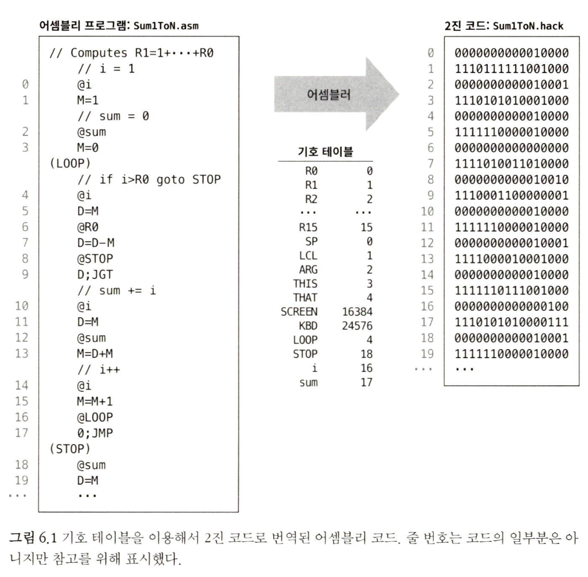

# 6장 어셈블러

> 목표 : 어셈블러가 어떻게 작동하고, 어떻게 어셈블러를 구현하는지 설명한다.

그 결과로 핵 어셈블러를 만든다.

`핵 어셈블러` : 핵 기호 언어로 작성된 프로그램을 핵 하드웨어에서 실행 가능한 2진 코드로 변역하는 프로그램이다.

어셈블러에는 사용자 정의 기호를 관리하고 물리적 주소에 할당하는 기능이 있다.
이 기능은 `기호 테이블(Symbol Table)`이라는 일반적인 데이터 구조로 구현된다.

## 6.1 배경

기계어는 보통 두 가지 형식, 기호와 2진 형식으로 정의된다.

`11000010000000110000000000000111` 같은 2진 명령어는 어떤 하드웨어에서 해석되고 실행되도록 미리 정의된 마이크로코드들이다. 예를 들어 이 명령어의 맨 왼쪽 8개 비트(11000010)는 'load' 같은 연산을, 그 다음 8개 비트(00000011)는 레지스터 R3를, 나머지 16개 비트(0000000000000111)는 어떤 값 7을 나타낼 수 있다.

그리고 하드웨어 아키텍처와 기게어를 설계하면서, 이 32비트 명령어가 "상수 7을 레지스터 R3에 로드하라" 라는 의미를 갖도록 만들 수 있을 것이다.

하지만 이런 연산을 2진 코드로 정의하기는 어렵다. -> `load R3 7`과 같은 형식이 좀 더 간편하고 자연스러울 것

`load`와 같은 연상 코드는 `연상 기호(mnemonic)`라 부른다.

> [!NOTE]
> 연상 기호(mnemonic)은 라틴어로 '무언가를 기억하는 데 도움이 되도록 만든 문자 패턴' 이라는 뜻을 가진다.

따라서, 연상 기호에서 2진 코드로 변화하는게 간단하기 때문에, 기호 표기법으로 저수준 프로그램을 작성하고, 2진 코드로 번역하도록 하는게 합리적일 것이다.

이 기호 언어를 `어셈블리(assemly)`, 번역기를 `어셈블러(assembler)`라고 한다.

> [!NOTE]
> 어셈블러는 어셈블리 명령어의 필드를 `분석(parse)`해서 2진 코드로 변환시키고, 그 코드들을 실제로 하드웨어에서 실행가능한 2진 명령어로 `조립(assemble)`한다.

#### 기호

goto 312라는 기호 명령어가 있고 번역하면, 컴퓨터에게 주소 312에 저장된 명령어를 불러오고 실행하라는 명령이 된다.

그리고 만약 이 명령어가 어떤 루프의 시작점이라 해보자, 그렇다면 312 대신 LOOP 같이 이해하기 좋은 레이블로 표시하고 goto 312 대신 goto LOOP라고 명령을 사용하면 가독성과 이식성을 늘리는데 도움이 될 것이다.

> [!TIP]
> 어셈블리어가 기호를 사용하는 3가지 이유

- 레이블 label: 어셈블리 프로그램은 코드 내 위치를 표시하기 위해 기호를
  정의하고 사용한다. (ex: LOOP, END).
- 변수 variable: 어셈블리 프로그램은 기호 변수를 정의하고 사용할 수 있다.
  (ex: i, sum).
- 선언 기호 predefined symbol: 어셈블리 프로그램은 미리 선언된 기호를 사용해서 컴퓨터 메모리 내의 특정 주소를 참조할 수 있다. (ex: SCREEN, KBD).

물론 이 값 SCREEN = 16384, LOOP = 312를 뜻한다는 기호를 관리하는게 필요하다.

#### 예제

사람에게 편리한 기호 코드와 컴퓨터가 이해할 수 있는 2진 코드 사이의 간극을 메워 주는 역할을 하는 것이 바로 어셈블러다.

아래 그림을 보면 첫 번째로 줄 번호는 코드의 일부가 아니지만, 번역 과정에서(암시적이긴 하지만) 중요한 역할을 한다. 만약 2진 코드가 주소 0부터 시작하는 명령어 메모리에 로드된다고 하면, 각 명령어의 줄 번호는 메모리 주소와 일치한다.

두 번째로, 주석 및 레이블 선언은 아무런 코드도 생성하지 않는다는 사실인데, 그 때문에 레이블 선언이 의사 명령어(pseudo-instruction)라 불리기도 한다.

> **그림 6.1** 기호 테이블을 이용해서 2진 코드로 번역된 어셈블리 코드, 줄 번호는 코드의 일부분은 아니지만 참고를 위해 표시

## 6.2 핵 기계어 명세
