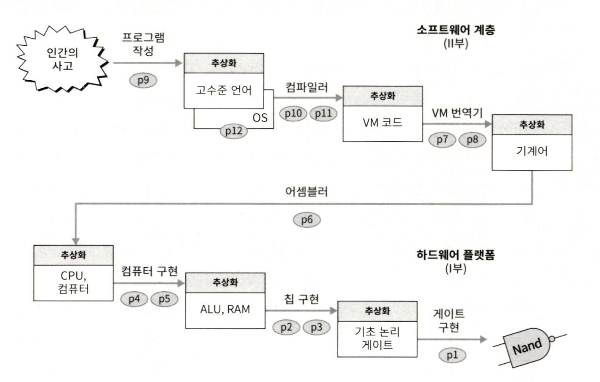

# 서론

## 컴퓨터 동작 원리

사람이 작성한 고수준 코드의 문자열을 컴퓨터가 이해할 수 있도록 분석하여 실행 가능한 기계어 명령어들로 변환되고, 하드웨어에서 기계어를 실행하여 결과물을 우리가 볼 수 있는 것이다.

아래 그림은 이 책에서 컴퓨터의 동작에 대해 접근법을 추상화한 것이다.



## 컴퓨터를 이해하기 위한 접근 방법

> [!NOTE]
> Nand can do EVENYTHING!

`모든 논리 게이트는 Nand 게이트만으로 만들 수 있다.`

산업적으로 널리 쓰이는 컴퓨터 모델을 만들고 유명한 고수준 언어에 대한 컴파일러를 작성하는 방법도 있었을 것이다. 하지만 세 가지 이유 때문에 이 책에선 그 길을 선택하지 않았다.

- 컴퓨터 모델은 왔다가 사라지고, 한때 인기 있던 프로그래밍 언어도 새로운 언어에 자리를 내준다. 따라서 특정 하드웨어 / 소프트웨어 구성에만 매이고 싶지 않았다.

- 실제 사용되는 컴퓨터와 언어들은 교육적 가치는 별로 없지만, 구현하는데 한세월이 걸리는 세부 기능이 너무 많다.

- 제어하기 쉽고, 이해하기 쉽고, 확장하기 쉬운 하드웨어와 소프트웨어 플랫폼이 필요했다.

일반적으로 컴퓨터 시스템을 설명할 때는, `높은 수준의 추상화`가 어떻게 더 `단순한 추상화`로 구현되는지 하향식 top-down으로 설명한다.

예를 들어 어떤 컴퓨터 아키텍처에서 실행되는 2진 명령어가, 어떻게 더 작은 코드들로 쪼개져서 아키텍처의 전선을 통해 전달되고 최종적으로 어떻게 저수준 ALU와 RAM 칩을 조작하게 되는지 설명할 수 있을 것이다.

또는 상향식 bottom-up으로, ALU와 RAM 칩이 어떻게 잘 모여서 코드들을 실행하는 2진 기계 명령어군을 구성하는지 설명하는 방법도 있을 것이다.

## 추상화와 구현

> [!NOTE]
> 위에서부터 `추상화`라는 단어가 많이 언급되었는데, 컴퓨터 세계에서 추상화란 의미는 없어선 안될 필수적인 단어라고 생각한다.

기초 논리 게이트만 이용해서 밑바닥부터 컴퓨터 시스템을 어떻게 구성하는지, 모듈로 하나씩 쪼개서 공부할 예정이다.

좋은 모듈 디자인이란 시스템의 나머지 부분을 신경 쓰지 않아도 되도록 모듈을 독립적으로 만드는 것이다. -> 올바른 추상화 방법

> [!NOTE]
> 시스템 설계의 중요성<br/>
> 모듈을 어떤 순서로 만들든, 개별적으로 올바른 동작을 해야하기 때문에 순서가 상관없다.<br/>
> 모듈별로 테스트 코드가 올바르게 수행된다면 합쳤을 때에도 문제가 없을 것.

그렇다면 어떻게 복잡한 시스템을 '**잘**' 만들 수 있을까?

`분할과 정복` 인지 능력은 모듈의 추상화(abstraction)와 구현(implementation)을 식별하는 사고방식에 의해 강화된다.

> 추상화(abstraction) : 모듈이 '무엇을 하는지'<br/>
> 구현(implementation) : 모듈이 '어떻게 수행하는지'

#### 시스템 공학에서 가장 중요한 규칙

> 어떤 모듈이든 구성 블록으로 사용할 때는 모듈의 추상화에만 집중하고, 상세 구현은 완전히 무시해야 한다.

저수준 하드웨어나 소프트웨어 모듈을 사용해서 구현할 때는 이 모듈들을 단순하게 여겨야 한다.

구현에 필요한 건 오로지 모듈이 '무엇'을 하는지 설명하는 인터페이스 문서뿐이다.
모듈 인터페이스가 말하는 것을 '어떻게' 수행하는지에 대해서는 신경 쓰지 말아야 한다.

> [!NOTE]
> 왜 이렇게까지 추상화와 구현을 독립적으로 생각하도록 유도할까?

```html
덧셈기(Adder) 모듈을 생각해 봅시다. 인터페이스는 두 개의 숫자를 입력받아 합계를
출력하는 기능을 정의합니다. 구현은 다양한 방식으로 할 수 있습니다. 예를 들어,
반가산기와 전가산기를 연결하여 구현할 수도 있고, 다른 알고리즘을 사용하여 구현할
수도 있습니다. 중요한 것은 인터페이스가 변경되지 않는 한, 덧셈기를 사용하는 다른
모듈은 구현이 어떻게 되었는지 알 필요가 없다는 것입니다. - Google AIStudio
```

내가 느끼는 이유는 아래와 같다.

- 병렬 개발
- 기술 변화에 대한 유연성

실제로 내가 백엔드 개발자와 협업하기 위해 API Interface를 작성하면 동시에 개발을 진행할 수 있다.
해당 인터페이스에 대한 정의가 바뀌지 않는다면 구현은 얼마든 바뀔 수 있다.

이런 점들이 크게 와닿았다.

책에서도 누차 얘기를 하지만, **이 패러다임은 하드웨어 및 소프트웨어 구축 프로젝트에서 가장 중요한 설계원리**라고 강조한다.

> [!TIP]
> **추상화** 때로는 모듈 또는 인터페이스라고도 함
