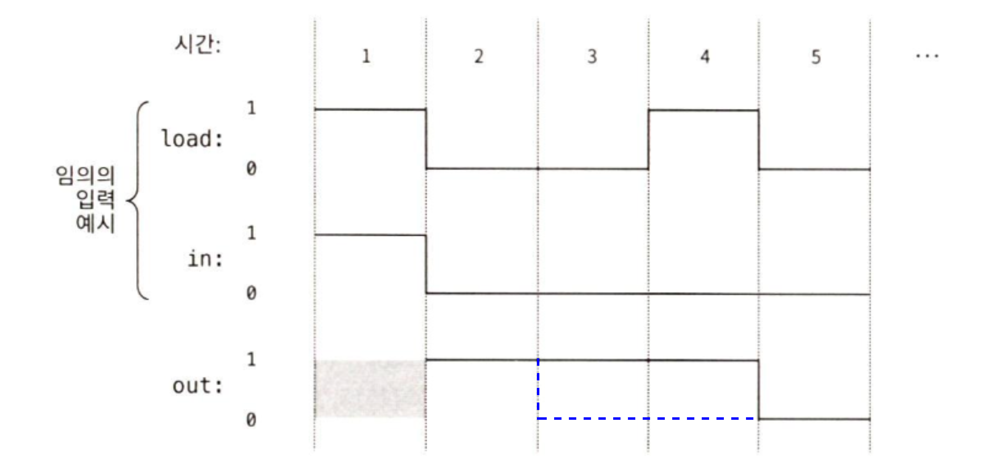

## 3장

> 순차 논리 기술에 대해서 배우고, '순차 칩'에 해당하는 DFF, Register, RAM, Counter를 만들어본다.   

 

### 1. 새롭게 알게 된 내용
* **순차 논리**
	* 이전 상태(과거의 입력값)에 따라 현재 출력이 결정됨 
		* '시간 진행' 모델링
		* 논리 게이트가 '상태를 유지'하고 '시간이 변함에 따라 응답'
* **순차 논리 회로**
	* **DFF(Data Flip-Flop)**
		* 시간이 지나도 정보를 기억하고 저장하는 메모리 칩의 최소 단위
		* 0과 1 두 안정 상태 사이를 왔다갔다(filp and flop) 해서 붙은 이름
		* 순차칩은 모두 직, 간접적으로 DFF를 포함
        
            
	* **Register**
		* 비트 정보 저장
		* load 값에 따라서 읽기/쓰기 결정
		* Register 상태를 읽으려면 out값을 조사
			* out 값이 이전 in 값과 동일하면 쓰기 상태(load == 1), out 값이 이전 out 값과 동일하면 읽기 상태(load == 0)
		* feedback loop에서 DFF를 거치므로 시간 지연이 생겨 data race 가 발생하지 X
			* t 시점의 출력은 자기 자신이 아닌 t-1의 출력에 따르게 되기 때문
			
			
	* **RAM** = Register x N
		* 각 레지스터마다 특정 주소(0 ~ N-1) 할당
		* addressing 기능을 통해 특정 Register에 접근 => 읽기 / 쓰기
			 ✔︎ address는 칩 하드웨어 일부가 아님
			
	* **Counter** 
		* inc == 1이면 매 클록 주기마다 값을 1씩 증가
		* reset == 1이면 counter 값이 0으로 초기화
		* counter 값을 v로 설정하고 싶으면 load 비트 활성화하고 in에 v 입력
		* Register 칩과 증분기로 구현
			

### 2. 어려웠거나 궁금했던 점 
* **클록 입력과 load의 차이점**
		
	* 클록 입력은 시스템 전체 동작을 동기화하기 위해 전용 클록 버스를 통해 주기적으로 입력되는 이진 신호
	* load 값이 1이면 쓰기 입력, load 값이 0이면 읽기 입력
		* if load == 1 out(t) = in(t-1), else out(t) = out(t-1)
* 조합칩은 시간의 진행과는 상관이 없는데 조합칩의 또다른 이름이 왜 '시간 의존성 칩'이지? (61페이지)

### 3. 흥미로웠던 점
* RAM의 크기나 레지스터 주소와 무관하게 임의로 선택된 메모리 레지스터에 접근하는 시간은 즉각적
	* 랜덤 엑세스 방식을 사용하기 때문
	* 모든 주소 접근이 전자적으로 이루어져서 물리적 이동 없음
	* 주소 디코딩과 데이터 액세스 속도가 일정
        * 주소 디코딩이란? 논리 게이트(AND, NAND, NOR 등)를 이용하여 주어진 메모리 주소를 해석하여 해당 주소의 메모리 셀(레지스터)을 활성화하는 과정. 즉, CPU가 특정 주소를 요청하면, 주소 디코더가 논리 연산을 수행하여 그 주소에 해당하는 메모리 레지스터만 선택적으로 활성화
        * 예를 들어, 8개의 레지스터로 구성되어있는 RAM일 때, 6번 레지스터 주소(110₂)에 접근 요청 시 AND 게이트를 사용한다면 불함수 𝑎₂ AND 𝑎₁ AND NOT(𝑎₀) 을 통해 6번 레지스터 활성화
* 컴퓨터 과학자 관점의 시간은 '주기'라는 이산적인 간격의 '순차적 진행'
	* 이산적이란? 연속적이지 않고 개별적인 값으로 이루어진 것
		
* **주기 전환 시에는 변화가 일어나고 주기 진행 중에는 변화가 정지되는 것처럼 보이는 이유**
	* 우리는 주기가 끝날 때만 상태를 확인하므로 시간 지연을 관찰하지 못 함
* **시간 지연이 없는 것처럼 보이게 동작시키려면** 
	* 비트 하나가 칩 안에서 가장 긴 경로를 따라서 전송되는 시간과 칩 내부에서 가장 오래 걸리는 계산 시간을 더한 값보다 한 주기의 길이가 더 길어야 함
	* 그러면서도 가능한 한 컴퓨터가 빠르게 동작하도록 한 주기의 길이는 충분히 짧아야 함

### 4. 추가 내용
* 구현
	* 1 Bit Register
		
	* RAM8
		