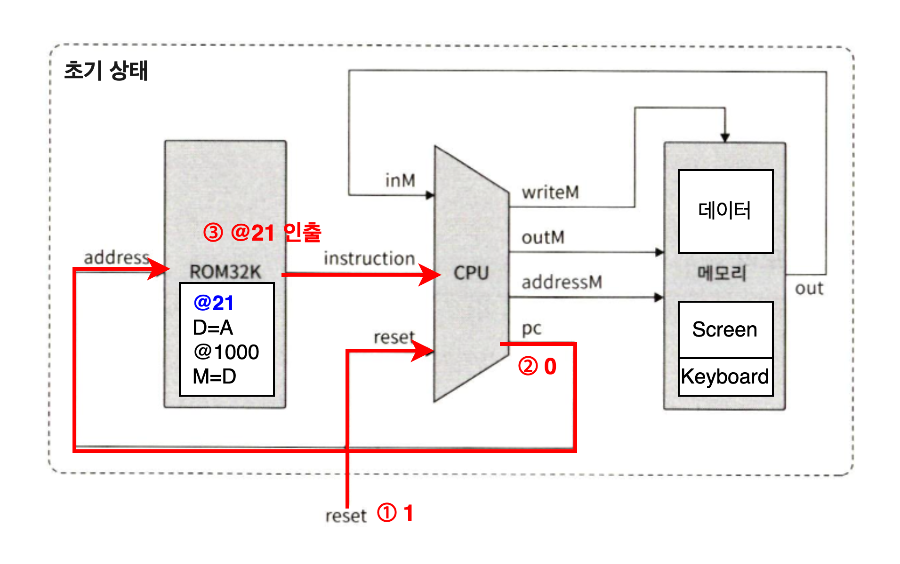
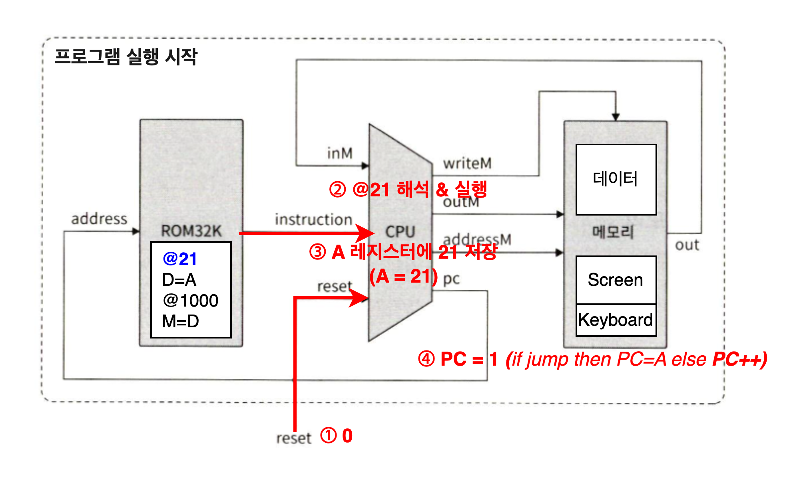
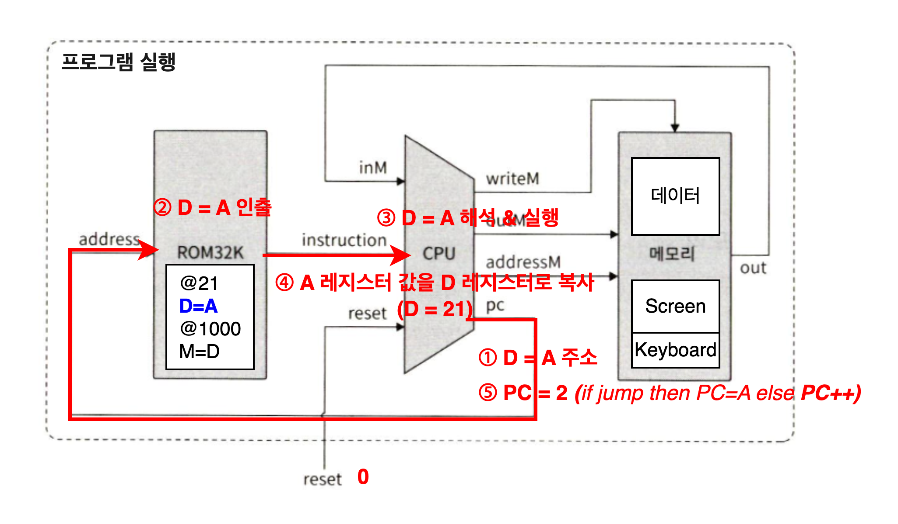
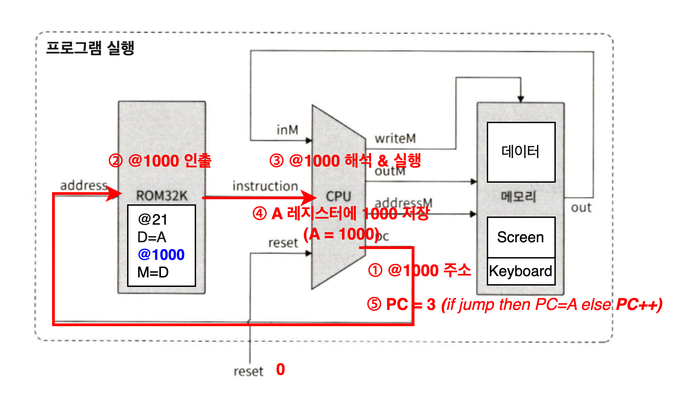
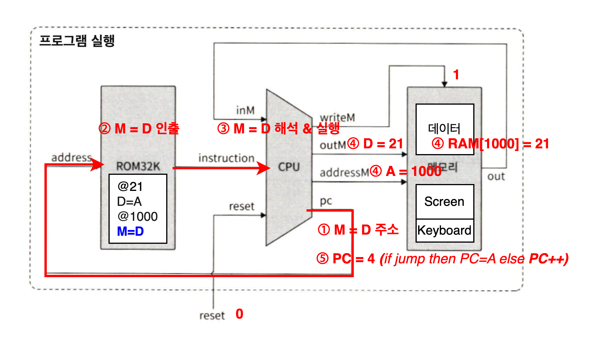

## 5장

>  폰 노이만 구조 기반의 컴퓨터의 아키텍쳐에 대해서 배운다.

### 1. 새롭게 알게 된 내용
* **내장식 프로그램**
	* 프로그램이 하드웨어에 내장되지 않고 명령어 메모리에 데이터처럼 저장되는 방식
* **폰 노이만 구조**
	* 중앙처리 장치가 메모리 장치와 통신
	* 입력 장치에서 데이터 수신
	* 출력 장치로 데이터 송신
	
* **메모리**
	* ROM(Read Only Memory) - 명령어 메모리
		* 기계어로 작성된 프로그램 저장
	* RAM(Random Access Memory) - 데이터 메모리
		* 데이터 저장 및 CPU와 I/O 장치 사이의 인터페이스 역할
* **CPU**
	* ALU(Arithmetic Logic Unit)
	* 레지스터
		* 데이터 레지스터(data register)
		* 주소 레지스터(address register)
			* 데이터 값 저장
			* 명령어 메모리에서 주소 선택
			* 데이터 메모리에서 주소 선택 
		* 프로그램 카운터(program counter)
			* 다음에 실행해야 하는 명령어 주소 저장
		* 명령어 레지스터(instruction register)
	* 제어
		* CPU 내에 지정된 하드웨어 장치로 전달되어 마이크로코드로 디코딩된 
	* 인출-실행
		* CPU는 인코딩된 명령어를 '인출 -> 디코딩 -> 실행'하고 다음에 실행될 명령어까지 로딩
* **I/O**
	* 메모리 매핑 I/O -> 수많은 입출력 장치들의 복잡성을 추상화 -> 모든 I/O 장치가 동일한 인터페이스 사용 -> 컴퓨터 시스템이 자신과 통신할 I/O 장치의 구체적 특징과 무관함
* 메모리 맵
	*  각 I/O 장치별로 전용 메모리 영역 할당
		* 키보드 키를 누르면 해당 키의 2진 코드가 키보드의 메모리 맵에 나타나는 형식
	* 메모리 맵을 조작하면 모든 I/O 장치에 접근 가능

### 2. 어려웠던 점
* 메모리 맵 방식
	* 왜 2차원 픽셀 격자로 구성된 스크린이 1차원 블록으로 매핑되는지 
		* 결국 2진법 비트열로 표현되어 1차원 메모리 상에 저장되어야 하기 때문
* ROM에서 명령어를 출력하는데 프로그램 실행 명령어들이 ROM에 있는 것 아닌가?
	* HACK 컴퓨터에만 해당되는 이야기. HACK에서는 ROM이 곧 명령어 메모리이고, 실행할 프로그램(기계어 명령어들)이 미리 저장되어 있음
	* 현대 범용 컴퓨터는 ROM이 아니라 SSD/HDD에 프로그램을 저장 -> 실행 시에는 RAM으로 올라감. ROM에는 하드웨어 부팅 및 제어 관련 기계어 명령어들만 저장되어 있음
* HACK 컴퓨터는 명령어 메모리와 데이터 메모리가 분리되어 있어서 인출-실행이 한 주기 안에서 일어나는데, 범용 컴퓨터는 명령어 메모리와 데이터 메모리가 일체형이라 인출 주기와 실행 주기가 따로 일어난다?
	* HACK 컴퓨터는 **하버드 구조**로, 명령어 메모리와 데이터 메모리가 물리적으로 분리되어있기 때문에 CPU가 명령어를 인출하는 동안에도 데이터 메모리에 접근이 가능
	* 즉, 한 클럭 사이클 내에서 명령어를 명령어 메모리에서 가져오고 필요한 데이터를 데이터 메모리에서 읽거나 쓸 수 있음
	* 범용 컴퓨터는 폰 노이만 구조로 명령어 메모리와 데이터 메모리가 같은 버스(주소/데이터 선)를 공유하기 때문에 한 클럭 사이클 내에서 명령어 인출 또는 데이터 접근 중 하나만 할 수 있음
	* 따라서 일반적으로 첫번째 사이클에서는 명령어를 인출하고 두번째 사이클에서는 명령어를 실행하면서 데이터를 메모리에서 가져옴
* 실행 흐름 이해
	* 초기 상태
		
	* 프로그램 실행 시작
		
	* 프로그램 실행
		
		
		
