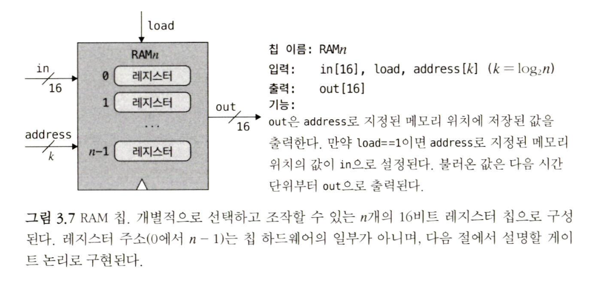

## 키워드

- 조합 칩(시간 의존성 칩) : 시간과 무관한 칩 (ex. ALU)
- 순차 칩 (클록 칩) : 이전에 처리했던 입력과 출력에 영향을 받는다 
- 클록(clock) : tick, tock 이라는 2진 신호를 연속적으로 생성
	- **클록을 이용해서 시간의 진행을 모델링**
- 주기(cycle) : 틱의 시작부터 톡의 종료 사이의 시간 (클록 주기)
- 데이터 플립-플롭 : 0과 1의 두 안정 상태를 왔다 갔다 할 수 있는 시간의존적 논리 게이트. 
	- 다른 메모리 장치 깊숙한 곳에서 제역할을 하는 저수준 부품. 
- 이산적 : **연결되지 않고 떨어져 있는 원소들로 구성된 것을 의미**. 
	- 연속적 개념과 대비되는 말로, 과학에서 연속의 반대 개념으로 쓰인다. 
- 경쟁 상태 (race condition) : 
	- 공학 분야에서 어떤 시스템에 둘 이상의 입력이 가해졌을 때, 그 입력의 순서나 타이밍에 따라 결과 값이 영향을 받아 시스템이 예상치 못하는 동작을 하는 상태를 가리킨다. 

## 3.1 메모리 장치 

"컴퓨터 프로그램은 변수, 배열, 객체 같이 시간이 지나도 데이터를 유지(기억)하는 추상화 개념들을 활용한다. 하드웨어 플랫폼은 **상태를 유지하는 메모리 장치**를 통해 이런 기능들을 지원한다. "

인간에게 당연하게 여겨지는, **'기억'**을 구현하기 위해 필요한 요소
- 시간의 진행을 모델링 하는 방법 - 클록
- 논리 게이트가 상태를 유지하고 시간이 변함에 따라 응답하도록 하는 방법 - 데이터 플립-플롭

## 3.2 순차 논리 
- "1장과 2장에서 나온 칩들(조합 칩)은 모두 시간에 무관한 고전적 논리를 기반으로 한다." 
- "따라서 메모리 장치를 구현하려면, **입력뿐 아니라 클록 틱의 변화에 따라 응답할 수 있도록 게이트 논리를 확장할 필요가 있다**"

### 3.2.1. 시간의 문제
"지금까지는 칩들이 입력에 **즉시 응답**한다고 가정했다." 
- 하지만 실제로는 적어도 다음의 두 가지 이유로 항상 지연이 발생한다.
1. **입력 신호의 이동** : 칩의 입력은 갑자기 나타나지 않는다. 
	- 입력 신호는 다른 칩의 출력에서 이동해 온 것이며, 이동에는 시간이 걸린다.  
2. **계산 수행 시간** : 칩이 계산을 수행하는 데도 시간이 걸린다. 
	- 칩에 부품이 많을 수록, 논리가 정교할수록 칩 회로에서 출력이 다 만들어질 때까지 시간이 더 오래 걸릴 것이다. 

 "시간은 보통 끊임없이 앞으로 나아가는 화살표로 은유되고, 연속적으로 생각된다"
- 즉, 두 시점 사이에는 항상 또 다른 시점이 있고, 그 사이의 변화는 무한히 작다고 본다.
	- 철학자와 물리학자에게는 이런 시간 개념이 친숙 할것이다
- 컴퓨터 과학자에게는 너무 심오하고 불가사의한 개념이다.
	- 따라서 컴퓨터 과학자는 시간이 연속적으로 진행된다고 보지 않고, 주기라는 고정된 길이의 간격으로 쪼개서 보는 편이다.
	- 주기 개념에서 시간은 더 이상 쪼개지지 않고 가장 기본적인 단위가 된다. 
	- **"주기가 전환될 때만 실제로 세상에 변화가 일어나고, 주기 도중에는 세상의 변화가 정지된다."**

"시간을 이산적으로 생각하면 연속적인 변화를 무시할 수 있다."
- 각 주기의 중간에 그 상태가 어떨지는 신경 쓰지 않을 것이다.
- 이산적인 시간 개념은 컴퓨터 설계에 있어서 두 가지 주요 특성을 가져온다.
	1. 통신이나 계산 중에 발생하는 시간 지연과 관련된 무작위성을 줄일 수 있다. 
	2. 여러 칩들의 연산을 동기화 하는 데 그 개념을 활용할 수 있다. 

"최대 지연 시간보다 한 주기의 길이가 더 길어야 한다는 사실을 알아차렸을 것이다."
- 실제로 하드웨어 플랫폼 설계에서 **주기의 길이**는 가장 중요한 변수 중에 하나다.
- 하드웨어 엔지니어는 컴퓨터를 설계할 때 두 가지 목표를 달성하도록 주기 길이를 고른다.
	1. **어떤 시간 지연이든 문제가 없을 정도로 주기를 길게 잡는다.** 
	2. **가능한 한 컴퓨터가 빠르게 동작하도록 주기를 짧게 잡는다.** 
		1. 주기가 전환될 때만 변화가 생기기 때문에, 당연히 주기가 짧을수록 동작도 빨라진다. 
- **"요약하면, 주기 길이는 시스템 내 모든 칩에서 발생하는 최대 시간 지연보다는 살짝 더 길게 잡아야 한다."**
- "스위치 기술이 엄청나게 발전함에 따라 이제 우리는 주기를 10억분의 1초보다 더 짧게 만들 수 있으며, 컴퓨터 속도도 놀라울 정도로 빠르게 되었다."

"마스터 클록 신호는 하드웨어의 회로망을 통해 컴퓨터에 있는 **모든 메모리 칩**에 동시에 전달된다"
- 이러한 모든 칩 내에서 클록 입력은 저수준의 DFF 게이트로 보내지며, 칩은 새로운 상태로 바뀌고 클록 주기의 끝에서만 값을 출력하게 된다. 
- 마스터 클록 신호 -> 모든 메모리 칩 -> DFF 

### 3.2.2. 플립-플롭
"메모리 칩은 시간이 지나도 정보를 '기억'하고 저장하도록 설계된 칩이다. 이렇게 저장에 대한 추상화 개념을 실현해 주는 저수준 장치가 바로 플립-플롭 게이트로, 이 게이트에는 몇 가지 다른 종류가 있다."
- "nandToTetris"에서는 입력 및 출력이 1비트 데이터로 된 DFF 를 사용한다."
- "DFF에는 마스터 클록 신호에서 오는 클록 입력도 있다."
- DFF는 데이터 입력과 클록 입력을 조합해서 out(t) = in(t-1)라는 시간에 따른 간단한 동작을 구현한다. 
	- in, out은 게이트의 입력과 출력 값이고, t는 현재 시간 단위를 뜻한다. 
	- "이 동작을 어떻게 구현하는지는 걱정하지 말자."
	- **"지금은 각 시간 단위가 끝날 때 DFF가 이전 시간 단위의 입력 값을 출력한다는 사실만 알면 된다."**

- **궁금증**
	- out(t+1) = in(t)에서, in은 1과 0 둘 중하나만 들어오는건가 ? 
		- 컴퓨터 자체가 비트 값(2진수)만 다루기 때문에 당연히 1, 0 만 존재 하지..
	- t는 어디 저장되는거지 ? 
		- (걱정하지 말자고 함)
		- 마스터 클록은 플리플롭을 트리거 하는 역할만 한다고 한다. 
		
**"DFF는 Nand게이트와 마찬가지로 하드웨어 계층에서 가장 기초가 된다. 레지스터, RAM, 카운터 같은 모든 메모리 칩의 기반에 DFF 게이트들이 있음을 알 수 있다. 이 DFF들은 모두 마스터 클록에 연결되어 거대한 '합창단' 같이 행동한다. 각 클록 주기가 끝날 때, 컴퓨터 내 모든 DFF출력들은 이전 클록 주기의 입력에 따라 맞춰진다."**

### 3.2.3. 조합 및 순차 논리

"조합칩에 피드백 루프를 넣으면, 결국 출력이 자기 자신을 따라 결정된다는 문제가 생긴다"
- "하지만 피드백 루프가 DFF를 거친다면, 출력을 다시 입력으로 넣는 데 전혀 문제가 없다. "
- 시간 t의 출력이 자기 자신이 아니라 시간 t-1의 출력에 따르기 때문이다. 

"순차칩에 시간 의존성이 있어서 얻게 되는 중요한 부가효과는, 전체 컴퓨터 아키텍처를 동기화 하는데 이 특성을활용할 수 있다는 점이다."
- ALU에 x+y 계산 명령. 
	- x 는 근처 레지스터 출력 값, 
	- y 는 멀리 위치한 레지스터의 출력 값
- 데이터 값의 도달하는 시점에 따라 ALU 출력은 의미 없는 값이 된다. 
- 이산적인 시간 개념을 도입하면, 이 문제를 신경쓸 필요 없다. 
- 클록 주기를 살짝 더 길게 만들기만 하면 된다. 
- 서로 다른 하드웨어 부품들을 하나의 시스템으로 동기화 되도록 만드는 기술이다. 

## 3.3. 명세
### 3.3.1 데이터 플립-플롭 (DFF)

- DFF 입력에 1비트 값을 넣으면, DFF의 **'상태'** 가 이 값으로 설정되고, 다음 시간 단위에 이 값을 출력한다. (3.2.2. DFF 이미지)
	- **??? : 상태 변경과 다음 시간 단위의 의미** 
		- 입력 -> 상태 변경 
			=> out(t+1) = in(t) 와 같이 쓰는 이유가 상태이기 때문인가 ? 
			- 출력이 아니라, 계속 기록하는 ? 
		- 기록은 어디에 저장되는거지 
		- 출력 -> 출력이 트리거 될 때 ? 
### 3.3.2 레지스터 (DFF에 기반)

- bit (1비트 레지스터) / register (16비트 레지스터)
- bit 칩은 1비트 정보를 저장한다. 
- 인터페이스
	- in : 입력
	- load : 쓰기 기능 설정
	- out : 출력
- 사용법 (bit와 register 칩은 활용법이 동일하다)
	- 레지스터의 상태를 읽으려면 out 값을 조사한다 
	- 상태를 v로 설정하려면, 입력 in에 v를 넣고 load 비트를 활성화 한다. 
	- 이렇게 하면 레지스터의 상태가 v로 설정되고, 
	- 다음 시간 단위부터 레지스터가 새 값을 받아들여 out에 그 값을 출력하기 시작한다. 
- register 칩은 메모리 장치의 기본적인 기능을 하고 있음을 알 수 있다. 
	- 즉, 마지막에 쓰여진 값을 기억하고, 다른 값을 설정 할 때까지 그 값을 출력하는 것이다. 
### 3.3.3 RAM 장치 (레지스터에 기반)

- RAM은 n개의 register 칩으로 구성된다. 
- RAM은 각 레지스터마다 특정 주소 (0에서 n-1 까지 숫자)를 할당하고, 이 주소를 이용해 레지스터를 선택하고 읽기 / 쓰기 작업을 한다. 
- RAM의 크기나 레지스터의 주소, 갯수에 무관하게 동일한 시간 내에 해당 레지스터에 직접 접근하고 조작할 수 있다. 
	- RAM 장치를 매우 유용하게 만드는 이유
- 중요한 것은, RAM을 어떤 레지스터에 거의 즉각적으로 접근할 수 있음을 보장하도록 구현해야 한다는 점. 
	- 그렇지 않으면 컴퓨터가 비실용적일 정도로 느려지게 된다. 
	- 마법은 구현 절에서

### 3.3.4 카운터(Program Counter) 칩 (레지스터에 기반)

- 인터페이스 : inc, reset 을 제외하면 레지스터와 같다. 

## 3.4. 구현
### 3.4.1. 데이터 플립-플롭
- 조합 게이트 사이에 피드백 루프를 만들어야 하기 때문에 시뮬레이터로 모델링 하기 불가능하다. 
- 따라서 DFF를 기초 구성 블록으로 취급한다. 

### 3.4.2 레지스터

- 레지스터의 동작은 DFF의 동작과 유사하다 out(t+1) = in(t)
	- load비트가 없다 
- 다만, load 값이 필요하다
	- load 값은 내부적으로 멀티플렉서의 select로 구현 가능하다. 
- Load값은 데이터의 쓰기 여부를 결정한다.  

### 3.4.3. RAM
### 3.4.4. 카운터

## 3.5 프로젝트

## 3.6 정리 